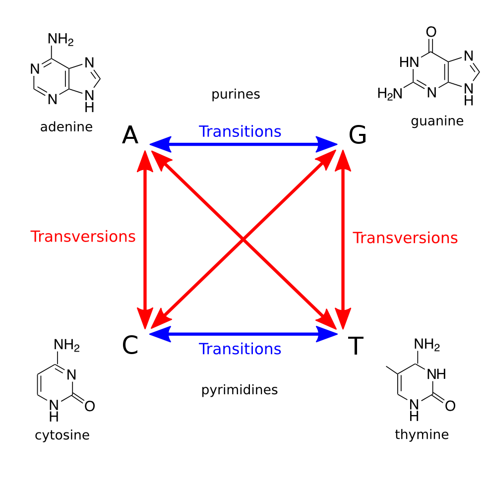

## What is parsimony doing anyway?

What assumption does parsimony make about how characters evolve? 

Go ahead, log into LONI, start an interactive sessions and load paup. 

Now, we'll start paup and read in the data.

```UNIX
paup

execute Data/primate-mtDNA.nex

alltrees
```

Copy down the score of the best tree.

What about making different assumptions?

Exit Paup.

Copy the BinaryMatrix.nex into our Data folder. Open the Binary Matrix. What are these data? Please add this matrix to the end of the file:

```
begin assumptions;
 usertype my_ctype stepmatrix=2
     0 1
 [0] . 1
 [1] 0 .

 ;
end;

```

What is this matrix specifying? Save it. Now, restart PAUP and do a quick hsearch:

```UNIX
execute Data/BinaryMatrix.nex
hsearch
```

Why is the score on this so much less than the multistate data set? 

Now, let's try using our custom matrix:

```
ctype my_ctype:1
hsearch
```

We have imposed a new step matrix on the first character in the matrix.

Let's draw it on the board. What kind of data do you think would fit this data? What kind of data would fit parsimony?

How does this impact the parsimony score of the data? Why does this make sense? What does this mean for how we conceive of these models? 

**Homework**: How is the parsimony score impacted if you set a different number of characters to the custom model?

## Modeling Sequence Evolution

Load in the primate-mtDNA.nex file. What does a step matrix look like for parsimony for nucleotide sequence data?

Perform an exhaustive parsimony search. Build a consensus tree and save it. 

Let's talk about different assumptions we can make about the way molecular sequences evolve. 

### Transitions and Transversions



Exercise on board making this transition matrix, then in text editor.

Apply the new matrix to the whole dataset (898 char), and perform an exhaustive parsimony search. 

How has this changed the parismony score of the best tree found? Make a consensus tree and save it. Download and view the two trees we've made. Are they different? 

**Homework**: Try the same analysis, except with a 3-1 weighting on transitions to transversions.

### Base Frequencies

This is where we will transition from thinking about parsimony to thinking about other methods. Think about a dataset that you have. Do you think that nucleotide bases occur at equal frequencies in those data?

On board: show how the probability of observing a change changes as a function of base frequency. 

## So what is likelihood anyway? 

First, let's review probability. Dice rolling activity. 

Next, let's look at how probability applies to phylogenetics. On board: tree, with ancestral states and probabilities labeled on them.

Now, let's work out the probability of this sequence under JC69. 

Now, let's do this in paup.

```unix
set crit=like;
lset nst=1 basefreq=equal;
hsearch;
```

But ... wait, we just calculated a single site likelihood, and it was really small. Why is this number so big?


Now let's try with two transition rates:

```unix
set crit=like;
lset nst=2 basefreq=equal;
hsearch;
```

What is your likelihood score? Do you think this is a better or a worse score? 

How does the two previous commands differ from:

```unix
set crit=like;
lset nst=1 basefreq=emp;
hsearch;
```

What is the score of this model? And finally:

```unix
set crit=like;
lset nst=2 basefreq=emp;
hsearch;
```

What is the score of this model? 


## How to make PAUP files executeable

For the homework, I've asked you to run several files. In the course repo, I have included a sample primate-executeable file inside the Paup_lab directory. Copy it into your PaupLab folder. Open it in Nano. Let's look at it together.

I have also included a sample qsub script in the course repository, in PaupLab/scripts. Copy it to your lab directory. Open it in Nano.


