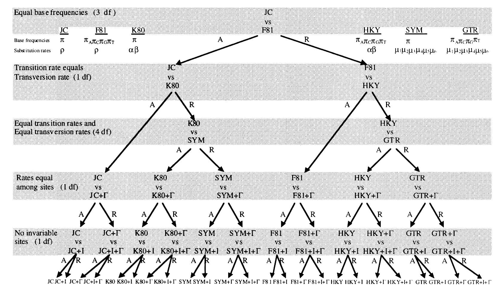
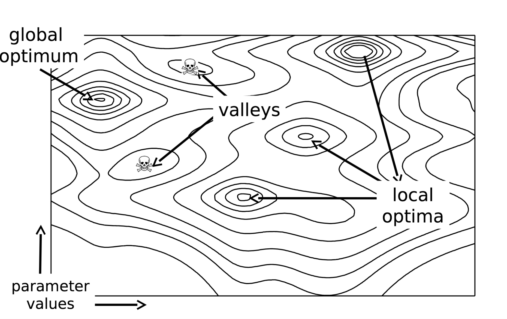

## How Does Estimating a Tree Under  Maximum Likelihood Differ From Under Parsimony?

Maximum parsimony will prefer the phylogeny that implies the fewest changes for a set of characters. Heuristic algorithms are used to search treespace when there are too many trees the exhaustively search. Different step matrices can be used, but there isn't a formalized hypothesis testing framework to know which step matrix is 'best', beyond seeing if it produces a lower parsimony score.

Maximum likelihood finds the combination of tree, branch lengths, and parameters that maximizes the likelihood score of the data. As you might imagine, searching the combinations of parameters and branch lengths with the tree, tree searching becomes much more onerous. Maximum likelihood, through the nesting of models, also allows for an explicit hypothesis testing framework to be applied to assess which model is the best fit for the data.

## What are these different models telling us about data?



## How can we compare different models? 

One common way is through hierarchical likelihood ratio tests. This framework, implemented in the software [ModelTest](https://academic.oup.com/mbe/article/25/7/1253/1045159), is one of the more intuitive to explain, and to try. So we'll start there. The hLRT compares the goodness of fit of the model to the data for a simpler model to the goodness of fit of the model to the data for a more complex model in which the simpler model nests. 

Adding parameters will improve a likelihood score. That makes a certain amount of intuitive sense - when we model data, we are probably never capturing the true complexity of the evolutionary process that generated the data. So there's likely to be extra variation not explained by the model. Adding parameters is bound to soak up some of that uncaptured variation. [Fit vs. Overfit]. The hLRT is meant to tell us if the gain score is large enough to justify the addition of parameters. 

In the process of comparsing models under the hLRT, we calculate the likelihood ratio test statistic:

LR = 2*(lnL1-lnL2)

in which L1 is the likelihood of the more complex model. The LR is Chi-Squared distributed, so we can simply use a Chi-Squared table to determine significance.

We will now carry out this test in PAUP using the primate mtDNA dataset.

Log in to LONI, begin an interactive session, and start paup. Execute the primates data.

First, we're going to calculate a quick likelihood tree:

```UNIX
set crit=l
lset nst=1 basefr=eq
hsearch
```

The default model for likelihood in PAUP is Jukes-Cantor. Fill in the model score on the table below.

| Model | Score | LR |
|-------|-------|----|
| Jukes-Cantor | x |    |
| F81   | x   | 2\*(lnL1-lnL2) = |  
| K80   | x  | 2\*(lnL1-lnL2) =  | 

How will we procede? Which model wins? What does this mean for which models we test next? 

What will be our PAUP specifications for the set of models we will test? Let's work them out as a group:


| Model | nst | basefr | Invariant sites? | Gamma Distributed rate heterogeneity | Score | LR |
|-------|-------|----|------|-------| -------|-----|
| Name of model | nst=      |  basefr=  | yes/no | gamma = | L= | 2\*(lnL1-lnL2) = | 
| Name of model   | nst=   | basefr= | yes/no | gamma = | L= | 2\*(lnL1-lnL2) = |
| Name of model   | nst=  | basefr=  | yes/no | gamma = | L= | 2\*(lnL1-lnL2) = |

**Homework Q2:** Which model wins?

jModelTest automates this whole process, by the way, and has a graphical interface that's pretty impossible to screw up. I just want you all to see **and understand** what is happening behind the scenes.

## How can model comparison be difficult?

For illustration, GTR+I+G gives us a score of:

```
 lset nst=6 basefr=estimate pinv=est rates=gamma
 hsearch
```
 
 Gives us a best tree score of: 5709.2787 . The best score you will find for models nested within K80 is -5971.83486 (or similar). In this case, we have been tightly constrained in  our comparisons because of where we could get by adding one degree of freedom. 
 
One way around this is to use a metric that allows for non-nested model comparisons. One such criterion is called the Akaike Information Criterion (AIC). Under the AIC, each model has an AIC score, calculated like so:

AIC = -2 ( ln ( likelihood )) + 2 K

in which K is the number of free parameters. 

| Model | Score | AIC |
|-------|-------|----|
| Jukes-Cantor | |AIC = -2 ( ln ( likelihood )) + 2 K |    
| F81   | x   | AIC = -2 ( ln ( likelihood )) + 2 K |  
| K80   | x  | AIC = -2 ( ln ( likelihood )) + 2 K  | 

This doesn't change much in terms of these initial comparisons, but allows us to make comparisons across non-nested models.

## Really quick note on topologies

I'm not sure we're going to do a full lab on topology testing. I'm just going to show you something really quick that you can test, given a model how much changing the relationships on a tree changes the likelihood score.

If you view your tree, you'll note that _Homo_ and _Pan_ fall out together. The below tree swaps chimps and gorillas.

```
constraints homogor (monophyly) = (1,(((((((2,4),3),5),6),(((7,8),9),10)),11),12));
```

We can then enforce this monophyletic constraint on the tree search:

```
hsearch constraints=homogor enforce=yes
```

This gives a very different likelihood for the tree. I'd be remiss not to mention this functionality, but I'm also not sure where else to put it.

You can also use lscore to score a parsimony tree under a given model, and pscore to score a likelihood tree under parsimony.


## Calculating ML trees

Very few people calculate ML trees in PAUP. You might be familiar with other software for calculating trees, like RAxML or FastTree. 




Let's look briefly at two tools from Mark Holder: 

[Tree optimization](http://phylo.bio.ku.edu/mephytis/tree-opt.html)

[Branch length optimization](http://phylo.bio.ku.edu/mephytis/brlen-opt.html)

As you can see, minor changes to the branch lengths can lead to big changes in the likelihood score. Now, consider that we are also optimizing a bunch of parameters, as well. 

The way we typically search treespace is using Markov Chain Monte Carlo.

I have placed a Phylip formatted in the classroom repo. Move into the classroom repo, do a git pull, and observe which file has been added. In your copy, make a new folder called "raxmllab" and add this file to its data directory (which you'll also have to create). 

Enter this directory, and load raxml

```
module load raxml
```

And execute a tree search 

```
raxmlHPC-PTHREADS-SSE3 -m GTRGAMMA -s Data/primates.phy -n sample -p 869877

```


